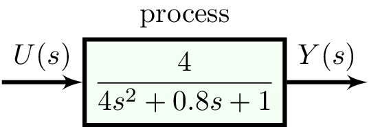

# Controlz.jl

`Controlz.jl` is a pure-[Julia](https://julialang.org/) package to analyze and simulate process dynamics and control systems using transfer function representations.

e.g., the code below simulates the unit step response of a second-order, underdamped system: 



with
* transfer function $g(s) = \dfrac{4}{4s^2 + 0.8s +1}$
* input $U(s)=\mathcal{L}[u(t)]$
* output $Y(s)=\mathcal{L}[y(t)]=g(s)U(s)$
where $\mathcal{L}[\cdot]$ is the Laplace transform that maps a function in the time domain $t\in\mathbb{R}$ to the frequency domain $s\in\mathbb{C}$.

```julia
using Controlz

g = 4 / (4 * s ^ 2 + 0.8 * s + 1) # construct transfer function
U = 1 / s                         # unit step input, U(s)
Y = g * U                         # system output, Y(s)

data = simulate(Y, 50.0)          # simulate until t = 50

viz_response(data, title="SO underdamped step response")
```


# install the `Controlz.jl` package in Julia

`Controlz.jl` is an officially registered Julia package. install in the Julia REPL by typing `]` to enter package mode, then `add Controlz`.

to write `Controlz.jl` code interactively and display the outputs, use the interactive [Pluto notebook](https://github.com/fonsp/Pluto.jl). Its automatic package manager installs `Controlz.jl` upon running `using Controlz` in a code cell.
