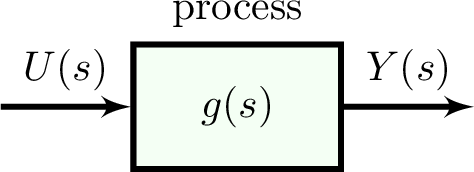
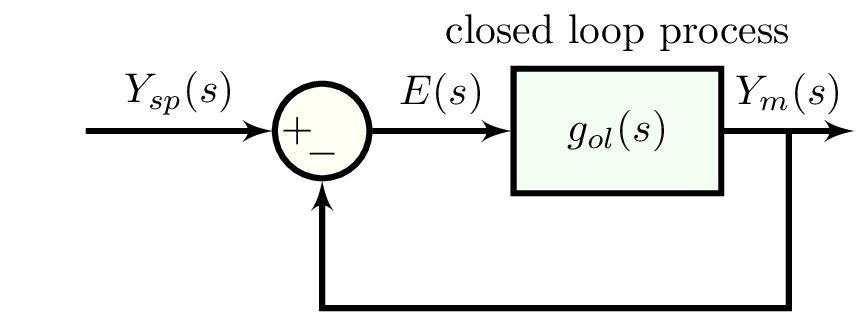
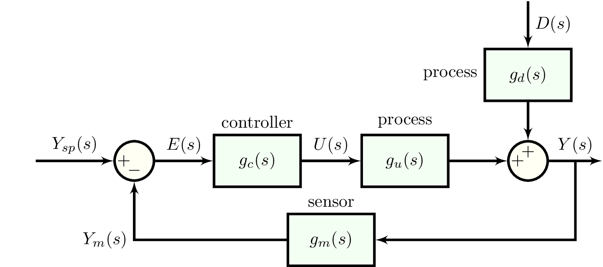

```@meta
DocTestSetup = quote
    using Controlz
end
```
# transfer functions

the response [output, $Y(s)$] of a linear, time-invariant system to any input [$U(s)$] is characterized by a transfer function $g(s)=Y(s)/U(s)$, with $s$ a complex variable.



a data structure, `TransferFunction`, represents a transfer function. 

## constructing a transfer function

for example, consider the transfer function
$$g(s)=\dfrac{5s+1}{s^2 + 4s+5}$$.

*constructor 1.* we can construct $g(s)$ in an intuitive way that resembles the algebraic expression:

```jldoctest
julia> g = (5 * s + 1) / (s ^ 2 + 4 * s + 5) # method 1
     5.0*s + 1.0
---------------------
1.0*s^2 + 4.0*s + 5.0
```

*constructor 2.* alternatively, we can construct a `TransferFunction` using the coefficients associated with the powers of $s$ in the polynomials composing the numerator and denominator, respectively, of the rational function $g(s)$. coefficients of the highest powers of $s$ are listed first.
```jldoctest gdef; output=false
julia> g = TransferFunction([5, 1], [1, 4, 5]) # method 2
     5.0*s + 1.0
---------------------
1.0*s^2 + 4.0*s + 5.0
```

!!! note
    under the hood, `s == TransferFunction([1, 0], [1])`.

### time delays

to construct a transfer function with a time delay, such as $$g(s)=\dfrac{3}{2s+1}e^{-2s}$$...

```jldoctest gdef
julia> θ = 2.0                              # time delay
julia> g = 3 / (2 * s + 1) * exp(-θ * s)    # method 1
julia> g = TransferFunction([3], [2, 1], θ) # method 2
    3.0
----------- e^(-2.0*s)
2.0*s + 1.0
```

## accessing attributes of a transfer function
as rational functions associated with a time delay, each `TransferFunction` data structure has a `numerator`, `denominator`, and `time_delay` attribute. access as follows:

```jldoctest gdef
julia> g.numerator
Polynomials.Polynomial(1.0 + 5.0*s)
```

```jldoctest gdef
julia> g.denominator
Polynomials.Polynomial(5.0 + 4.0*s + 1.0*s^2)
```

```jldoctest gdef
julia> g.time_delay
0.0
```

`g.numerator` and `g.denominator` are `Polynomial`s from [Polynomials.jl](https://github.com/JuliaMath/Polynomials.jl).

## zeros, poles, k-factor representation

we can write any transfer function $g(s)$ in terms of its poles ($p_j$), zeros ($z_j$), k-factor ($k$), and time delay ($\theta$):

$$g(s)=k\dfrac{\Pi_j (s-z_j)}{\Pi_j(s-p_j)}e^{-\theta s}$$

the scalar factor $k$ allows us to uniquely specify a transfer function in terms of its poles, zeros, and time delay. note that the $k$-factor is not equal to the zero-frequency gain.

for example, consider:

$$g(s)=\dfrac{5s+1}{s^2 + 4s+5}=5\dfrac{(s+1/5)}{(s+2+i)(s+2-i)}$$

#### constructing a transfer function from its zeros, poles and k-factor

```jldoctest
julia> g = zeros_poles_k([-1/5], [-2 + im, -2 - im], 5.0, time_delay=0.0)  # method 3
     5.0*s + 1.0
---------------------
1.0*s^2 + 4.0*s + 5.0
```

`im` is the imaginary number $i$. see the [Julia docs on complex numbers](https://docs.julialang.org/en/v1/manual/complex-and-rational-numbers/).


#### computing the poles, zeros, and k-factor of a transfer function

```jldoctest
julia> g = (5 * s + 1) / (s ^ 2 + 4 * s + 5)
julia> z, p, k = zeros_poles_k(g) # [-0.2], [-2-im, -2+im], 5
([-0.2], ComplexF64[-2.0000000000000004 - 1.0000000000000004im, -2.0000000000000004 + 1.0000000000000004im], 5.0)
```

## transfer function algebra

add `+`, subject `-`, multiply `*`, and divide `/` transfer functions.

```jldoctest alg
julia> g₁ = 3 / (s + 2)
julia> g₂ = 1 / (s + 4)
julia> g_product = g₁ * g₂
         3.0
---------------------
1.0*s^2 + 6.0*s + 8.0
```

```jldoctest alg
julia> g_sum = g₁ + g₂
    4.0*s + 14.0
---------------------
1.0*s^2 + 6.0*s + 8.0
```

## evaluate a transfer function at a complex number

for example, to evaluate $g(s)=\dfrac{4}{s+2}$ at $s=-2+i$:
```jldoctest
julia> g = 4 / (s + 2)
julia> evaluate(g, - 2 + im)
0.0 - 4.0im
```

## zero-frequency gain of a transfer function

compute the zero-frequency gain of a transfer function $g(s)$, which is $g(s)$ evaluated at $s=0$, as follows:

```jldoctest
julia> g = (5 * s + 1) / (s ^ 2 + 4 * s + 5)
julia> zero_frequency_gain(g)
0.2
```

the zero-frequency gain is the ratio of the steady state output value to the steady state input value (e.g., consider a step input). note that the zero-frequency gain could be infinite or zero, which is why we do not have a function to construct a transfer function from its zeros, poles, and *zero-frequency gain*.

## poles, zeros, and zero-frequency gain of a transfer function

compute the poles, zeros, and zero-frequency gain of a transfer function all at once as follows:

```jldoctest
julia> g = (5 * s + 5) / (s ^ 2 + 4 * s + 5)
julia> z, p, gain = zeros_poles_gain(g)
([-1.0], ComplexF64[-2.0000000000000004 - 1.0000000000000004im, -2.0000000000000004 + 1.0000000000000004im], 1.0)
```

## cancel poles and zeros

cancel pairs of identical poles and zeros in a transfer function as follows:

```jldoctest
# define g(s) = s * (s+1) / ((s+3) * s * (s+1) ^ 2)
julia> g = TransferFunction([1, 1, 0], [1, 5, 7, 3, 0])
julia> pole_zero_cancellation(g) # 1 / ((s+3) * (s+1))
                1.0
-----------------------------------
1.0*s^2 + 4.000000000000003*s + 3.0
```

under the hood, `pole_zero_cancellation` compares all pairs of poles and zeros to look for identical pairs via `isapprox`. after removing identical pole-zero pairs, we reconstruct the transfer function from the remaining poles and zeros---in addition to its k-factor. we ensure that the coefficients in the resulting rational function are real.

!!! note 
    pole-zero cancellation is done automatically when multiplying, dividing, adding, and subtracting transfer functions, as illustrated below.

```jldoctest
julia> g = s * (s+1) / ((s+3) * s * (s+1) ^ 2)
                1.0
-----------------------------------
1.0*s^2 + 4.000000000000003*s + 3.0
```

## the order of a transfer function

we can find the *apparent* order of the polynomials in the numerator and denominator of the rational function comprising the transfer function:

```jldoctest
julia> g = (s + 1) / ((s + 2) * (s + 3))
julia> system_order(g)
(1, 2)
```

## frequency response of an open-loop transfer function

in the closed loop below, $Y_{sp}$ is the set point for the output, $E$ is the error, and $Y_m$ is the measurement of the output.



compute the critical frequency, gain crossover frequency, gain margin, and phase margin of a closed loop control system with open-loop transfer function `g_ol` with `gain_phase_margins`. for example, consider:

$$g_{ol}(s)=\dfrac{2e^{-s}}{5s+1}$$

```jldoctest margins
julia> g_ol = 2 * exp(-s) / (5 * s + 1)

julia> margins = gain_phase_margins(g_ol)
-- gain/phase margin info--
	critical frequency ω_c [rad/time]:       1.68868
	gain crossover frequency ω_g [rad/time]: 0.34641
	gain margin:                             4.25121
	phase margin:                            1.74798
```

access the attributes of `margins` via:
```jldoctest margins
julia> margins.ω_c          # critical freq. (radians / time)
julia> margins.ω_g          # gain crossover freq. (radians / time)
julia> margins.gain_margin  # gain margin
julia> margins.phase_margin # phase margin (radians)
1.7479849408794201
```


## special transfer functions

### (0, 1) order transfer functions

$$g(s)=\frac{K}{\tau s +1}$$

easily construct:

```jldoctest
julia> K = 2.0
julia> τ = 3.0
julia> g = first_order_system(K, τ)
    2.0
-----------
3.0*s + 1.0
```

compute time constant:
```jldoctest
julia> g = 10 / (6 * s + 2)
julia> time_constant(g)
3.0
```

### (0, 2) order transfer functions

$$g(s)=\frac{K}{\tau^2 s^2 + 2\tau \xi s +1}$$

easily construct:

```jldoctest sotf
julia> K = 1.0
julia> τ = 2.0
julia> ξ = 0.1
julia> g = second_order_system(K, τ, ξ)
         1.0
---------------------
4.0*s^2 + 0.4*s + 1.0
```

compute time constant, damping coefficient:
```jldoctest sotf
julia> τ = time_constant(g)
2.0
```
```jldoctest sotf
julia> ξ = damping_coefficient(g)
0.1
```

## closed-loop transfer functions

to represent a closed-loop transfer function, we use a special transfer function type, `ClosedLoopTransferFunction`.
this is only necessary when time delays are involved, but it works for when time delays are *not* involved as well.



using block diagram algebra, we find the closed-loop transfer functions that relate changes in the output $y$ to changes in the set point $y_{sp}$ and to changes in the disturbance $d$:

$$g_r(s)=\dfrac{Y(s)}{D(s)}=\dfrac{g_d(s)}{1+g_c(s)g_u(s)g_m(s)}$$

$$g_s(s)=\dfrac{Y(s)}{Y_{sp}(s)}=\dfrac{g_c(s)g_u(s)g_m(s)}{1+g_c(s)g_u(s)g_m(s)}$$

we construct these two closed-loop transfer functions as `gr` and `gs` as follows.

```jldoctest cltf
# PI controller transfer function
julia> pic = PIController(1.0, 2.0)
julia> gc = TransferFunction(pic)

# process, sensor dynamics
julia> gu = 2 / (4 * s + 1) * exp(-0.5 * s)
julia> gm = 1 / (s + 1) * exp(-0.1 * s)
julia> gd = 6 / (6 * s + 1)

# open-loop transfer function
julia> g_ol = gc * gu * gm

# closed-loop transfer function for regulator response
julia> gr = ClosedLoopTransferFunction(gd, g_ol)
closed-loop transfer function.
      top
    -------
    1 + g_ol

  top =
    6.0
-----------
6.0*s + 1.0

  g_ol =
       4.0*s + 2.0
-------------------------- e^(-0.6*s)
8.0*s^3 + 10.0*s^2 + 2.0*s
```
```jldoctest cltf
# closed-loop transfer function for servo response
>julia gs = ClosedLoopTransferFunction(g_ol, g_ol)
closed-loop transfer function.
      top
    -------
    1 + g_ol

  top = 
       4.0*s + 2.0
-------------------------- e^(-0.6*s)
8.0*s^3 + 10.0*s^2 + 2.0*s

  g_ol = 
       4.0*s + 2.0
-------------------------- e^(-0.6*s)
8.0*s^3 + 10.0*s^2 + 2.0*s
```

## detailed docs

```@docs
    TransferFunction
    ClosedLoopTransferFunction
    zero_frequency_gain
    zeros_poles_gain
    zeros_poles_k
    pole_zero_cancellation
    evaluate
    proper
    strictly_proper
    characteristic_polynomial
    zpk_form
    system_order
    first_order_system
    second_order_system
    time_constant
    damping_coefficient
    gain_phase_margins
```
